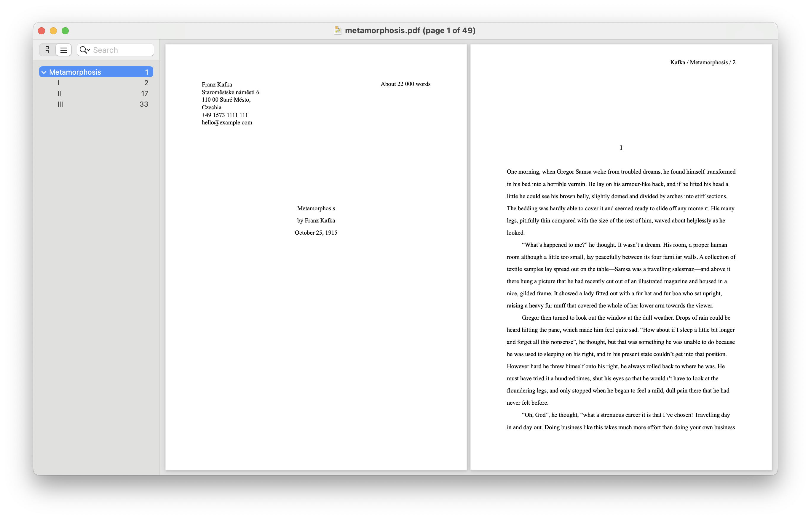

# Manuscript tool

Generates properly formatted manuscript PDFs from a Markdown file.

Preparation:

1. Install Python 3 (e.g. `brew install python`)
1. Install pandoc (e.g. `brew install pandoc`)

To build:

1. Run `make`

The input lives in `src/` (e.g. `src/metamorphosis.md`) and the output will end up in `dist` (e.g. `dist/metamorphosis.pdf`).
